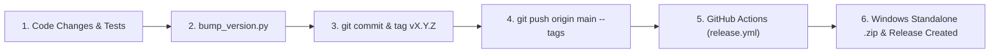

# NeuroPest Versioning Strategy

This document defines the versioning scheme, update rules, and release procedures for **NeuroPest**.

---

## 1. Scheme: Semantic Versioning (`MAJOR.MINOR.PATCH`)

NeuroPest strictly adheres to [Semantic Versioning 2.0.0](https://semver.org/) with git tags prefixed by `v` (e.g. `v0.5.1`).

```
vMAJOR.MINOR.PATCH
  │     │     └─ Bug fixes, dependency adjustments, small UI tweaks
  │     └─────── New sensory/motor features, 3D views, skins, non-breaking architecture
  └───────────── Breaking dataset format changes, major connectome revisions, architecture rewrites
```

### When to increment `PATCH` (`0.5.0` $\rightarrow$ `0.5.1`)
Increment the patch version for backwards-compatible bug fixes and minor refinements:
- **Dependency & Build adjustments**: Moving dependencies (e.g., bundling WebGPU/`wgpu` out-of-the-box so `--extra gpu` is no longer required).
- **Bug fixes**: Fixing edge clipping, locomotion artifacts, race conditions, memory leaks, or UI display glitches.
- **UI & copy polish**: Text refinements, translations, label overflows, tooltip clarifications.
- **Internal performance improvements**: Micro-optimizations in the LIF simulation loop or 3D viewer that do not alter the public interfaces or behavior models.
- **Documentation & CI fixes**: Workflow script adjustments, asset updates.

### When to increment `MINOR` (`0.5.x` $\rightarrow$ `0.6.0`)
Increment the minor version when substantial new biological or user-facing functionality is added in a backwards-compatible manner:
- **New sensory channels**: Integrating compound eye screen capture (`Screen Capture Vision`), acoustic, or chemical sensing channels.
- **New behavioral or neural modules**: Introducing 3D Mushroom Body connectome visualizers, dopamine plasticity training sandbox, new descending neuron decoders.
- **New visual skins & animations**: Adding new fly costumes or articulated gait cycles.
- **New simulation engines**: Adding a new hardware acceleration backend (e.g., initial introduction of WebGPU or specialized tensor engine).
- **New persistent features**: Adding persistent valence storage, multi-fly or multiplayer interactions.

### When to increment `MAJOR` (`0.x.y` $\rightarrow$ `1.0.0` or `1.x.y` $\rightarrow$ `2.0.0`)
Increment the major version for incompatible or paradigm-shifting changes:
- **Connectome Dataset Migration**: Moving from FlyWire v783 to a new connectome release (e.g. FAFB v2, MANC integration, or larva) where synapses and neuron IDs are incompatible.
- **Incompatible Memory / Storage Schema**: Changes to `.npz` caches or saved learned synaptic weights that cannot be migrated automatically.
- **Architecture Paradigms**: Migrating the underlying inter-process communication protocol or breaking public Python library interfaces.
- **Production Milestone (`v1.0.0`)**: Designates general feature-completeness, stabilized biological fidelity benchmarks, and mature Windows standalone distribution.

---

## 2. Synchronized Version Locations

Whenever a version is bumped, all **7 locations** must be synchronized simultaneously:

| # | File | Field / Location | Purpose |
|---|------|------------------|---------|
| 1 | `pyproject.toml` | `[project] version = "X.Y.Z"` | Package distribution metadata |
| 2 | `neuropest/__init__.py` | `__version__ = "X.Y.Z"` | Runtime version attribute |
| 3 | `neuropest/data_manager.py` | `User-Agent: NeuroPest-Downloader/X.Y.Z` | HTTP request telemetry |
| 4 | `CITATION.cff` | `version: X.Y.Z`, `date-released: "YYYY-MM-DD"` | Academic citation metadata |
| 5 | `README.md` | `**Current State (vX.Y.Z):**`, download zip links | User quickstart documentation |
| 6 | `.github/workflows/release.yml` | Fallback tag `'vX.Y.Z'` | CI standalone build fallback |
| 7 | `uv.lock` | `version = "X.Y.Z"` (via `uv lock`) | Locked package graph |

---

## 3. Automated Version Bumping

To eliminate manual file editing and prevent out-of-sync version numbers, use the automated helper:

```bash
# Bump patch (0.5.0 -> 0.5.1)
uv run python tools/bump_version.py patch

# Bump minor (0.5.1 -> 0.6.0)
uv run python tools/bump_version.py minor

# Bump major (0.5.1 -> 1.0.0)
uv run python tools/bump_version.py major

# Set an explicit version
uv run python tools/bump_version.py 0.5.2

# Automatically commit and create the annotated git tag:
uv run python tools/bump_version.py patch --commit --tag -m "release: v0.5.1 with out-of-the-box WebGPU acceleration"
```

---

## 4. Release & Publishing Workflow



1. **Verify quality**: Ensure `uv run pytest` and `uv run ruff check .` pass.
2. **Bump version**: Run `uv run python tools/bump_version.py patch` (or `minor`).
3. **Commit**: `git commit -m "release: vX.Y.Z <summary>"`
4. **Tag**: `git tag -a vX.Y.Z -m "Release vX.Y.Z: <summary>"`
5. **Publish**: `git push origin main --tags`
6. **CI Packaging**: GitHub Actions automatically:
   - Builds `NeuroPest.exe` via PyInstaller on Windows.
   - Packages `NeuroPest-vX.Y.Z-windows-x64.zip`.
   - Creates a published release under GitHub Releases with download assets.

---

## 5. Rollback & Correction Procedure

If an erroneous tag or release is pushed to GitHub:

1. **Delete local tag**:
   ```bash
   git tag -d vX.Y.Z
   ```
2. **Delete remote tag on GitHub**:
   ```bash
   git push origin --delete vX.Y.Z
   ```
3. **Delete GitHub Release**:
   Delete the orphaned draft or release directly via the [GitHub Releases UI](https://github.com/IrohAmca/NeuroPest/releases).
4. **Fix version and re-tag**:
   Use `tools/bump_version.py` with the corrected target and re-publish.
